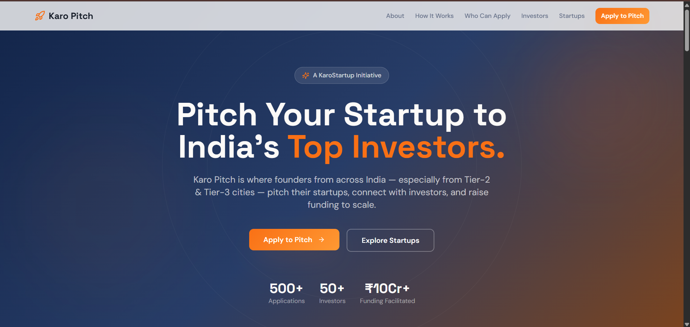

# Karoo Pitch Connect

A modern landing page connecting Karoo startups with investors. This platform showcases startup opportunities and facilitates connections between entrepreneurs and potential investors.

## Tech Stack

- **React** with TypeScript
- **Vite** for fast development and building
- **Tailwind CSS** for styling
- **shadcn/ui** for UI components
- **Framer Motion** for animations

## Getting Started

### Installation

```bash
# Install dependencies
npm install
# or
bun install
```

### Development

```bash
# Start development server
npm run dev
```

Visit `http://localhost:5173` in your browser.

### Build

```bash
# Production build
npm run build

# Preview production build
npm run preview
```

## Project Structure

- `src/components/` - React components including Hero, About, and feature sections
- `src/components/ui/` - Reusable UI components from shadcn/ui
- `src/pages/` - Page components
- `src/hooks/` - Custom React hooks
- `src/lib/` - Utility functions

### 🌐 Live Website
**https://karoo-pitch.vercel.app/**

### 📸 Screenshot

*Screenshot of the Karoo Pitch Connect homepage*

### 📝 Development Notes

**AI Tool Used:**
- GitHub Copilot - Used for code assistance and component development

**Design Decisions:**
- **Modern & Professional**: Clean, corporate design to establish credibility with investors
- **Clear Navigation**: Intuitive sections (Hero, About, How It Works, etc.) guide users through the platform's value proposition
- **Component-Based Architecture**: Modular React components for maintainability and scalability
- **Responsive Design**: Mobile-first approach using Tailwind CSS to ensure accessibility across devices
- **Smooth Animations**: Framer Motion for engaging user experience without overwhelming visitors
- **shadcn/ui Components**: Professional, accessible UI components that maintain consistency
- **Investor-Focused**: Structured content flow designed to convert investor interest into action


